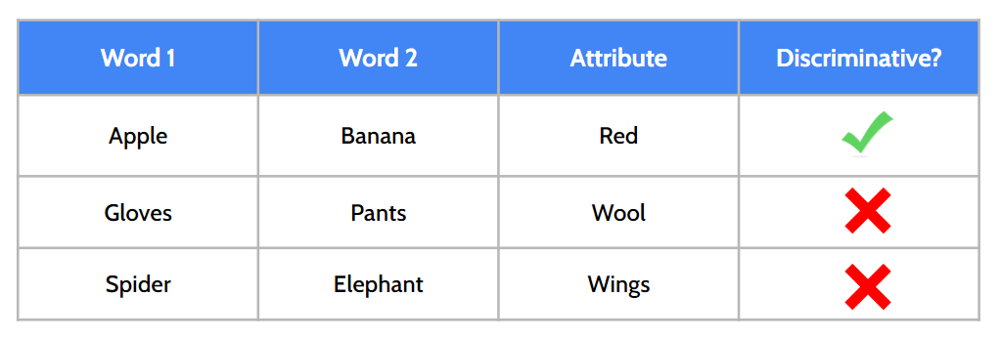
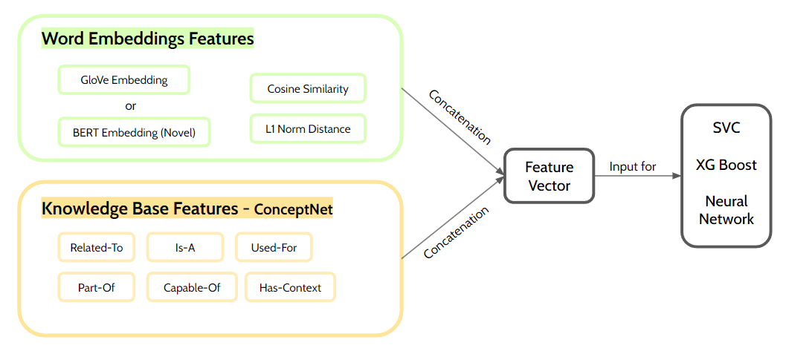

# Capturing-Discriminative-Attributes

  

## Description
This project aims to solve the shared task [SemEval 2018 Task 10](https://aclanthology.org/S18-1117/). Capturing Discriminative Attributes task consists in identifying whether an attribute could help discriminate between two concepts. For example, a successful system should determine that urine is a discriminating feature in the word pair kidney,bone. The aim of the task is to better evaluate the capabilities of state of the art semantic models, beyond pure semantic similarity.

Our approach is based on the following pipeline:

  

## Installation

### Install requirements
`pip install -r requirements.txt`

### Download required resources
* GloVe embeddings
`https://huggingface.co/stanfordnlp/glove/resolve/main/glove.6B.zip`

Once downloaded, unzip in `resources` folder. Files should follow the following structure:
    
    resources\glove.6B\glove.6B.50d.txt
    resources\glove.6B\glove.6B.100d.txt
    resources\glove.6B\glove.6B.200d.txt
    resources\glove.6B\glove.6B.300d.txt

## Usage
### Train classifier
`train.py` function requires argurments, use the following command to take a look at them:

`python train.py -h`

## Authors
* Lucia Urcelay
* Rasmus Siljander

